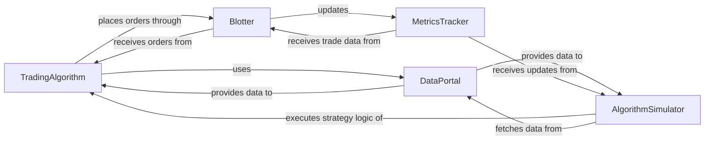

## Component Details

The `zipline` backtesting engine is built around a few critical components that orchestrate the simulation of trading strategies against historical market data. These components work in concert to provide a realistic and robust environment for strategy development and evaluation.

### TradingAlgorithm
The central user-defined component where the trading strategy logic is implemented. It defines how the algorithm reacts to market data, places orders, and manages its state. It's the "brain" of the backtest, encapsulating the user's investment thesis.

**Related Classes/Methods**:

- `zipline.finance.trading_algorithm.TradingAlgorithm` (0:0)

### AlgorithmSimulator
The core execution engine that drives the backtest. It iterates through market data bar by bar, advances the simulation clock, and triggers the `TradingAlgorithm`'s lifecycle methods (`before_trading_start`, `handle_data`). It's the "heartbeat" that orchestrates the entire simulation process.

**Related Classes/Methods**:

- <a href="https://github.com/quantopian/zipline/blob/master/zipline/gens/tradesimulation.py#L33-L305" target="_blank" rel="noopener noreferrer">`zipline.gens.tradesimulation.AlgorithmSimulator` (33:305)</a>

### DataPortal
The unified interface for accessing all historical and current market data (prices, adjustments, dividends, splits) for various assets. It abstracts the underlying data storage mechanisms, providing a consistent and efficient way for other components to retrieve necessary financial information. It acts as the "memory" or "knowledge base" of the system.

**Related Classes/Methods**:

- <a href="https://github.com/quantopian/zipline/blob/master/zipline/data/data_portal.py#L99-L1424" target="_blank" rel="noopener noreferrer">`zipline.data.data_portal.DataPortal` (99:1424)</a>

### Blotter
Manages the lifecycle of orders, from creation to execution. It applies financial models (like slippage and commission) to simulate realistic trade costs and updates the portfolio state based on executed trades. This component is the "action arm," translating theoretical orders into simulated market actions.

**Related Classes/Methods**:

- <a href="https://github.com/quantopian/zipline/blob/master/zipline/finance/blotter/simulation_blotter.py#L42-L392" target="_blank" rel="noopener noreferrer">`zipline.finance.blotter.simulation_blotter.SimulationBlotter` (42:392)</a>

### MetricsTracker
Collects, aggregates, and calculates various financial performance metrics (e.g., PNL, returns, risk, portfolio value) throughout the simulation. It maintains the overall financial state of the portfolio and account, providing the essential "reporting and analysis" for evaluating strategy performance.

**Related Classes/Methods**:

- <a href="https://github.com/quantopian/zipline/blob/master/zipline/finance/metrics/tracker.py#L25-L352" target="_blank" rel="noopener noreferrer">`zipline.finance.metrics.tracker.MetricsTracker` (25:352)</a>

### [FAQ](https://github.com/CodeBoarding/GeneratedOnBoardings/tree/main?tab=readme-ov-file#faq)