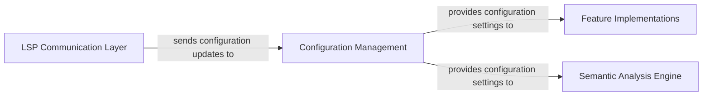

## Details

One paragraph explaining the functionality which is represented by this graph. What the main flow is and what is its purpose.

### Configuration Management [[Expand]](./Configuration_Management.md)
This component is responsible for managing both server-side and workspace-specific configurations. It receives configuration updates from the LSP client via the `LSP Communication Layer` and then provides these settings to other internal components, such as `Feature Implementations` and the `Semantic Analysis Engine`, to influence their behavior and adapt to user preferences or project-specific requirements.

**Related Classes/Methods**:

- `Configuration Management` (1:1)

### LSP Communication Layer [[Expand]](./LSP_Communication_Layer.md)
Handles communication with the LSP client.

**Related Classes/Methods**:

- `LSP Communication Layer` (1:1)

### Feature Implementations [[Expand]](./Feature_Implementations.md)
Implements various features of the system.

**Related Classes/Methods**:

- `Feature Implementations` (1:1)

### Semantic Analysis Engine [[Expand]](./Semantic_Analysis_Engine.md)
Performs semantic analysis.

**Related Classes/Methods**:

- `Semantic Analysis Engine` (1:1)

### [FAQ](https://github.com/CodeBoarding/GeneratedOnBoardings/tree/main?tab=readme-ov-file#faq)