```mermaid
graph LR
    LSP_Communication_Layer["LSP Communication Layer"]
    Document_Management["Document Management"]
    Language_Specific_Parser_and_AST_Representation["Language-Specific Parser and AST Representation"]
    Feature_Implementations["Feature Implementations"]
    LSP_Communication_Layer -- "sends document change notifications to" --> Document_Management
    Document_Management -- "provides latest document content to" --> Language_Specific_Parser_and_AST_Representation
    Document_Management -- "provides document content to" --> Feature_Implementations
    Feature_Implementations -- "leverages" --> Language_Specific_Parser_and_AST_Representation
    click LSP_Communication_Layer href "https://github.com/CodeBoarding/GeneratedOnBoardings/blob/main/zls/LSP_Communication_Layer.md" "Details"
    click Document_Management href "https://github.com/CodeBoarding/GeneratedOnBoardings/blob/main/zls/Document_Management.md" "Details"
    click Feature_Implementations href "https://github.com/CodeBoarding/GeneratedOnBoardings/blob/main/zls/Feature_Implementations.md" "Details"
```

## Details

One paragraph explaining the functionality which is represented by this graph. What the main flow is and what is its purpose.

### LSP Communication Layer [[Expand]](./LSP_Communication_Layer.md)
This component is the primary interface for interacting with the Language Server Protocol (LSP) client. It is responsible for sending and receiving all LSP messages, handling the serialization and deserialization of these messages, and managing the communication channel.

**Related Classes/Methods**:

- `src/Server.zig`

### Document Management [[Expand]](./Document_Management.md)
This component maintains an in-memory representation of all open and managed source code files. It is crucial for ensuring that the language server always operates on the most up-to-date content of files. It handles document synchronization events (e.g., textDocument/didOpen, textDocument/didChange, textDocument/didClose) and provides the latest content of files to other components that require source code access.

**Related Classes/Methods**:

- `src/DocumentStore.zig`
- `src/DocumentScope.zig`

### Language-Specific Parser and AST Representation
This component is responsible for parsing the Zig source code into a structured Abstract Syntax Tree (AST). It understands the grammar and syntax of the Zig language, converting raw text into a hierarchical data structure that can be easily traversed and analyzed by other components.

**Related Classes/Methods**:

- `src/ast.zig`
- `src/analyser/analyser.zig`

### Feature Implementations [[Expand]](./Feature_Implementations.md)
This component encompasses the various language server features that provide rich IDE functionalities, such as code completion, hover information, go-to-definition, find references, formatting, and diagnostics. These features leverage the AST and semantic analysis results to provide intelligent responses to client requests.

**Related Classes/Methods**:

- `src/features/`

### [FAQ](https://github.com/CodeBoarding/GeneratedOnBoardings/tree/main?tab=readme-ov-file#faq)