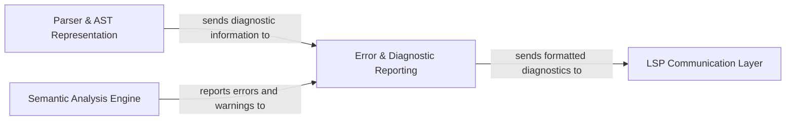

## Details

Abstract Components Overview

### Error & Diagnostic Reporting [[Expand]](./Error_Diagnostic_Reporting.md)
This component is responsible for centralizing the collection and aggregation of syntax and semantic errors, warnings, and other diagnostic messages. It receives raw diagnostic information from the Parser & AST Representation and the Semantic Analysis Engine. Its core function is to then format these diagnostics precisely according to the Language Server Protocol (LSP) specification, preparing them for efficient publication and transmission to the client via the LSP Communication Layer. This ensures that the client receives standardized and actionable feedback on code issues.

**Related Classes/Methods**: _None_

### Parser & AST Representation [[Expand]](./Parser_AST_Representation.md)
This component is responsible for taking the raw source code as input, performing lexical analysis to break it down into tokens, and then syntactic analysis to construct an Abstract Syntax Tree (AST). It identifies and reports syntax errors during this process, sending relevant diagnostic information to the Error & Diagnostic Reporting component. The generated AST serves as the foundational data structure for subsequent analysis phases.

**Related Classes/Methods**: _None_

### Semantic Analysis Engine [[Expand]](./Semantic_Analysis_Engine.md)
Operating on the Abstract Syntax Tree (AST) provided by the Parser & AST Representation, this component performs deeper semantic checks. This includes type checking, variable resolution, scope analysis, and other validations to ensure the code's logical correctness. It identifies semantic errors and warnings, which are then reported to the Error & Diagnostic Reporting component for formatting and transmission.

**Related Classes/Methods**: _None_

### LSP Communication Layer [[Expand]](./LSP_Communication_Layer.md)
This component manages all communication between the language server and the client, adhering strictly to the Language Server Protocol (LSP) specification. It is responsible for sending various messages to the client, including formatted diagnostic information received from the Error & Diagnostic Reporting component. It handles the serialization and deserialization of LSP messages, ensuring reliable and standardized data exchange.

**Related Classes/Methods**: _None_

### [FAQ](https://github.com/CodeBoarding/GeneratedOnBoardings/tree/main?tab=readme-ov-file#faq)