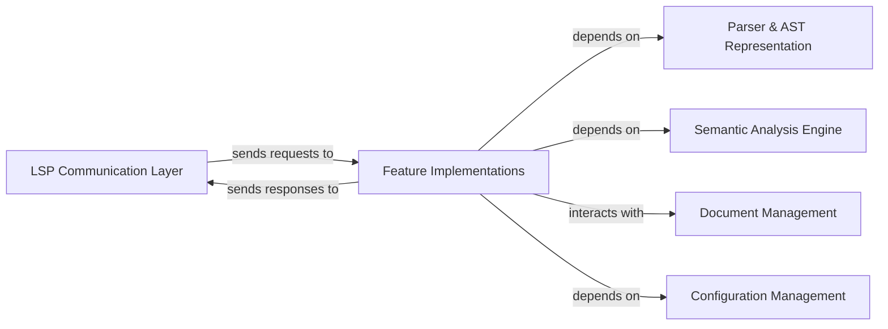

## Details

Abstract Components Overview for a Language Server

### LSP Communication Layer [[Expand]](./LSP_Communication_Layer.md)
This component is responsible for handling the Language Server Protocol (LSP) communication, including parsing incoming LSP requests from the client (e.g., VS Code) and serializing outgoing LSP responses and notifications back to the client. It acts as the primary interface between the language server's internal logic and the external development environment.

**Related Classes/Methods**: _None_

### Document Management [[Expand]](./Document_Management.md)
Manages the state of open documents, including their content, versions, and any associated metadata. It provides an up-to-date view of the source code files being edited, ensuring that features operate on the most current document content. It handles text synchronization requests (e.g., `textDocument/didOpen`, `textDocument/didChange`, `textDocument/didClose`).

**Related Classes/Methods**: _None_

### Configuration Management [[Expand]](./Configuration_Management.md)
Handles the retrieval and management of configuration settings for the language server, which can be provided by the client or defined within the project. This component ensures that language features and analysis are performed according to user-defined or project-specific preferences.

**Related Classes/Methods**: _None_

### Parser & AST Representation [[Expand]](./Parser_AST_Representation.md)
Responsible for parsing the source code of documents into an Abstract Syntax Tree (AST) or a similar structured representation. This component provides the foundational syntactic understanding of the code, which is then used by other components for analysis and feature implementation.

**Related Classes/Methods**: _None_

### Semantic Analysis Engine [[Expand]](./Semantic_Analysis_Engine.md)
Performs deeper semantic analysis on the parsed code (AST), including type checking, symbol resolution, scope management, and error detection. It builds a comprehensive understanding of the code's meaning and relationships, providing the rich context necessary for advanced language features.

**Related Classes/Methods**: _None_

### Feature Implementations [[Expand]](./Feature_Implementations.md)
Encompasses the implementation of all specific Language Server Protocol features (e.g., Code Completion, Go-to-Definition, Hover Information, Formatting, Refactoring). These are distinct modules responsible for handling specific LSP requests, acting as the core logic for providing language-specific functionalities. This component consumes parsed code (AST) from `Parser & AST Representation`, semantic analysis results from `Semantic Analysis Engine`, and document content from `Document Management`, while also producing LSP responses to the `LSP Communication Layer`. It leverages `Configuration Management` for feature-specific settings.

**Related Classes/Methods**:

- `features.mod` (1:1)

### [FAQ](https://github.com/CodeBoarding/GeneratedOnBoardings/tree/main?tab=readme-ov-file#faq)