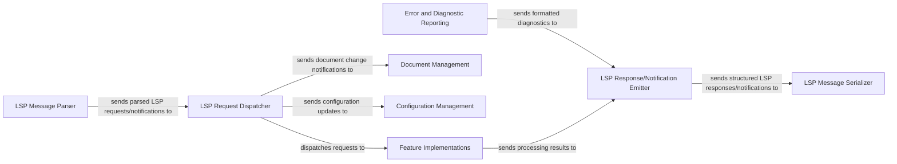

## Details

One paragraph explaining the functionality which is represented by this graph. What the main flow is and what is its purpose.

### LSP Message Parser
Responsible for deserializing raw incoming JSON messages from the LSP client into structured internal LSP request and notification objects, validating their format against the LSP specification.

**Related Classes/Methods**: _None_

### LSP Message Serializer
Responsible for serializing structured internal LSP response and notification objects into raw JSON messages, preparing them for transmission back to the LSP client.

**Related Classes/Methods**: _None_

### LSP Request Dispatcher
Routes incoming LSP requests and notifications to the appropriate internal handler components based on the LSP method. This component ensures that each request reaches the correct part of the server's logic.

**Related Classes/Methods**: _None_

### LSP Response/Notification Emitter
Gathers results, diagnostics, and other data from various internal components, formats them into compliant LSP responses or notifications, and prepares them for serialization and sending to the client.

**Related Classes/Methods**: _None_

### Feature Implementations [[Expand]](./Feature_Implementations.md)
Contains the core logic for handling specific Language Server Protocol features, such as code completion, go-to-definition, hover information, and refactoring. These implementations process the parsed LSP requests and generate results.

**Related Classes/Methods**: _None_

### Document Management [[Expand]](./Document_Management.md)
Manages the state and content of all open documents within the LSP server. It handles document synchronization (e.g., text changes, saves, closes) and provides an up-to-date view of the files to other components.

**Related Classes/Methods**: _None_

### Configuration Management [[Expand]](./Configuration_Management.md)
Responsible for managing and providing access to the server's configuration settings. It processes configuration change notifications from the client and makes updated settings available to other components that require them.

**Related Classes/Methods**: _None_

### Error and Diagnostic Reporting
Generates, collects, and manages diagnostic information (e.g., errors, warnings, hints) identified during code analysis or feature processing. It formats these diagnostics according to the LSP specification for transmission to the client.

**Related Classes/Methods**: _None_

### [FAQ](https://github.com/CodeBoarding/GeneratedOnBoardings/tree/main?tab=readme-ov-file#faq)