```mermaid
graph LR
    Document_Management["Document Management"]
    Parser_AST_Representation["Parser & AST Representation"]
    Semantic_Analysis_Engine["Semantic Analysis Engine"]
    Feature_Implementations["Feature Implementations"]
    Error_Diagnostic_Reporting["Error & Diagnostic Reporting"]
    Document_Management -- "provides Zig source code to" --> Parser_AST_Representation
    Parser_AST_Representation -- "provides AST to" --> Semantic_Analysis_Engine
    Parser_AST_Representation -- "provides AST to" --> Feature_Implementations
    Parser_AST_Representation -- "sends syntax error diagnostics to" --> Error_Diagnostic_Reporting
    Semantic_Analysis_Engine -- "provides semantic information to" --> Feature_Implementations
    Semantic_Analysis_Engine -- "sends semantic errors to" --> Error_Diagnostic_Reporting
    Feature_Implementations -- "sends diagnostics to" --> Error_Diagnostic_Reporting
    click Document_Management href "https://github.com/CodeBoarding/GeneratedOnBoardings/blob/main/zls/Document_Management.md" "Details"
    click Parser_AST_Representation href "https://github.com/CodeBoarding/GeneratedOnBoardings/blob/main/zls/Parser_AST_Representation.md" "Details"
    click Semantic_Analysis_Engine href "https://github.com/CodeBoarding/GeneratedOnBoardings/blob/main/zls/Semantic_Analysis_Engine.md" "Details"
    click Feature_Implementations href "https://github.com/CodeBoarding/GeneratedOnBoardings/blob/main/zls/Feature_Implementations.md" "Details"
    click Error_Diagnostic_Reporting href "https://github.com/CodeBoarding/GeneratedOnBoardings/blob/main/zls/Error_Diagnostic_Reporting.md" "Details"
```

## Details

One paragraph explaining the functionality which is represented by this graph. What the main flow is and what is its purpose.

### Document Management [[Expand]](./Document_Management.md)
This component is responsible for managing the lifecycle and content of Zig source code files within the language server. It handles opening, closing, and updating documents, providing the raw source code to other components for processing.

**Related Classes/Methods**:

- `DocumentStore.zig` (1:1)
- `DocumentScope.zig` (1:1)

### Parser & AST Representation [[Expand]](./Parser_AST_Representation.md)
This core component is responsible for parsing the raw Zig source code received from the `Document Management` component. It transforms the code into a structured Abstract Syntax Tree (AST), which serves as the foundational data structure for subsequent language processing. Additionally, it performs initial syntax error detection, generating diagnostic information.

**Related Classes/Methods**:

- `ast.zig` (1:1)
- `analyser.zig` (1:1)

### Semantic Analysis Engine [[Expand]](./Semantic_Analysis_Engine.md)
This component performs deeper semantic analysis on the Abstract Syntax Tree (AST) provided by the `Parser & AST Representation`. It resolves symbols, checks type consistency, and identifies semantic errors, enriching the AST with additional information required for advanced language features.

**Related Classes/Methods**:

- `analyser.zig` (1:1)
- `analysis.zig` (1:1)

### Feature Implementations [[Expand]](./Feature_Implementations.md)
This component encapsulates the logic for various language server features, such as code completion, diagnostics, go-to definition, hover information, and more. These features typically consume the AST and semantic information to provide rich language services to the client.

**Related Classes/Methods**:

- `completions.zig` (1:1)
- `diagnostics.zig` (1:1)
- `goto.zig` (1:1)

### Error & Diagnostic Reporting [[Expand]](./Error_Diagnostic_Reporting.md)
This component is responsible for collecting, formatting, and reporting errors and diagnostics identified during parsing, semantic analysis, and feature execution. It provides a unified mechanism for communicating issues back to the client.

**Related Classes/Methods**:

- `DiagnosticsCollection.zig` (1:1)
- `error_msg.zig` (1:1)

### [FAQ](https://github.com/CodeBoarding/GeneratedOnBoardings/tree/main?tab=readme-ov-file#faq)