```mermaid
graph LR
    LSP_Communication_Layer["LSP Communication Layer"]
    Document_Management["Document Management"]
    Parser_AST_Representation["Parser & AST Representation"]
    Semantic_Analysis_Engine["Semantic Analysis Engine"]
    Feature_Implementations["Feature Implementations"]
    Configuration_Management["Configuration Management"]
    Error_Diagnostic_Reporting["Error & Diagnostic Reporting"]
    LSP_Communication_Layer -- "forwards requests to" --> Document_Management
    LSP_Communication_Layer -- "dispatches requests to" --> Feature_Implementations
    LSP_Communication_Layer -- "forwards updates to" --> Configuration_Management
    Document_Management -- "provides source code to" --> Parser_AST_Representation
    Parser_AST_Representation -- "passes AST to" --> Semantic_Analysis_Engine
    Parser_AST_Representation -- "provides AST to" --> Feature_Implementations
    Parser_AST_Representation -- "reports errors to" --> Error_Diagnostic_Reporting
    Semantic_Analysis_Engine -- "provides information to" --> Feature_Implementations
    Semantic_Analysis_Engine -- "reports errors to" --> Error_Diagnostic_Reporting
    Configuration_Management -- "supplies settings to" --> Semantic_Analysis_Engine
    Configuration_Management -- "supplies settings to" --> Feature_Implementations
    Feature_Implementations -- "sends results to" --> LSP_Communication_Layer
    Error_Diagnostic_Reporting -- "publishes diagnostics to" --> LSP_Communication_Layer
    click LSP_Communication_Layer href "https://github.com/CodeBoarding/GeneratedOnBoardings/blob/main/zls/LSP_Communication_Layer.md" "Details"
    click Document_Management href "https://github.com/CodeBoarding/GeneratedOnBoardings/blob/main/zls/Document_Management.md" "Details"
    click Parser_AST_Representation href "https://github.com/CodeBoarding/GeneratedOnBoardings/blob/main/zls/Parser_AST_Representation.md" "Details"
    click Semantic_Analysis_Engine href "https://github.com/CodeBoarding/GeneratedOnBoardings/blob/main/zls/Semantic_Analysis_Engine.md" "Details"
    click Feature_Implementations href "https://github.com/CodeBoarding/GeneratedOnBoardings/blob/main/zls/Feature_Implementations.md" "Details"
    click Configuration_Management href "https://github.com/CodeBoarding/GeneratedOnBoardings/blob/main/zls/Configuration_Management.md" "Details"
    click Error_Diagnostic_Reporting href "https://github.com/CodeBoarding/GeneratedOnBoardings/blob/main/zls/Error_Diagnostic_Reporting.md" "Details"
```

## Details

High-level data flow overview of a Language Server Protocol (LSP) implementation for Zig.

### LSP Communication Layer [[Expand]](./LSP_Communication_Layer.md)
Handles all communication with the LSP client (IDE/editor), parsing incoming LSP requests and serializing outgoing LSP responses and notifications. It dispatches requests to the appropriate internal components and receives results/diagnostics for client publication.

**Related Classes/Methods**: _None_

### Document Management [[Expand]](./Document_Management.md)
Responsible for maintaining an in-memory representation of all open and managed source code files. It handles document synchronization events and provides the latest content of files to other components.

**Related Classes/Methods**: _None_

### Parser & AST Representation [[Expand]](./Parser_AST_Representation.md)
Takes Zig source code from the Document Management component and transforms it into an Abstract Syntax Tree (AST). This component also handles the initial detection of syntax errors.

**Related Classes/Methods**: _None_

### Semantic Analysis Engine [[Expand]](./Semantic_Analysis_Engine.md)
Performs deeper analysis of the AST to understand the meaning and correctness of the code. This includes type checking, symbol resolution, scope management, and detecting semantic errors, building and maintaining a symbol table.

**Related Classes/Methods**: _None_

### Feature Implementations [[Expand]](./Feature_Implementations.md)
Encompasses the implementation of all specific Language Server Protocol features (e.g., Code Completion, Go-to-Definition, Hover Information, Formatting, Refactoring), leveraging the AST and semantic information.

**Related Classes/Methods**: _None_

### Configuration Management [[Expand]](./Configuration_Management.md)
Manages server-side and workspace-specific configurations received from the LSP client. It provides configuration settings to other components, influencing their behavior.

**Related Classes/Methods**: _None_

### Error & Diagnostic Reporting [[Expand]](./Error_Diagnostic_Reporting.md)
Collects and aggregates syntax and semantic errors, warnings, and other diagnostic messages generated by the Parser and Semantic Analysis Engine. It then formats these diagnostics according to the LSP specification for publication to the client.

**Related Classes/Methods**: _None_

### [FAQ](https://github.com/CodeBoarding/GeneratedOnBoardings/tree/main?tab=readme-ov-file#faq)