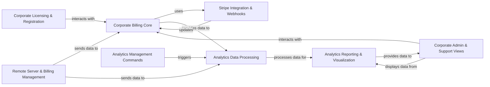

## Component Details

This component manages Zulip's commercial aspects, including paid plans, customer subscriptions, invoicing, and license enforcement, often integrating with external payment gateways. Concurrently, it focuses on collecting, processing, and presenting usage statistics and activity data for both individual organizations and the overall Zulip installation, providing insights into user activity, message counts, and billing-related metrics.

### Corporate Billing Core
This is the central hub for all billing-related operations, including customer management, plan subscriptions, upgrades, downgrades, and invoice generation. It provides the core business logic for managing paid plans and customer financial states. It is fundamental because it encapsulates the primary financial state and rules of the Zulip commercial offering.

**Related Classes/Methods**:

- <a href="https://github.com/zulip/zulip/blob/master/corporate/lib/stripe.py#L1-L1" target="_blank" rel="noopener noreferrer">`corporate.lib.stripe` (1:1)</a>
- <a href="https://github.com/zulip/zulip/blob/master/corporate/models/customers.py#L1-L1" target="_blank" rel="noopener noreferrer">`corporate.models.customers` (1:1)</a>
- <a href="https://github.com/zulip/zulip/blob/master/corporate/models/plans.py#L1-L1" target="_blank" rel="noopener noreferrer">`corporate.models.plans` (1:1)</a>
- <a href="https://github.com/zulip/zulip/blob/master/corporate/models/stripe_state.py#L1-L1" target="_blank" rel="noopener noreferrer">`corporate.models.stripe_state` (1:1)</a>
- <a href="https://github.com/zulip/zulip/blob/master/corporate/models/licenses.py#L1-L1" target="_blank" rel="noopener noreferrer">`corporate.models.licenses` (1:1)</a>
- <a href="https://github.com/zulip/zulip/blob/master/corporate/models/sponsorships.py#L1-L1" target="_blank" rel="noopener noreferrer">`corporate.models.sponsorships` (1:1)</a>
- <a href="https://github.com/zulip/zulip/blob/master/corporate/lib/billing_types.py#L1-L1" target="_blank" rel="noopener noreferrer">`corporate.lib.billing_types` (1:1)</a>

### Stripe Integration & Webhooks
This component specifically handles the direct integration with the Stripe payment gateway. It manages the creation of Stripe customers, subscriptions, and processes incoming webhook events from Stripe to update Zulip's internal billing state. It is fundamental as it provides the crucial bridge to the external payment system, enabling actual financial transactions.

**Related Classes/Methods**:

- <a href="https://github.com/zulip/zulip/blob/master/corporate/lib/stripe.py#L1-L1" target="_blank" rel="noopener noreferrer">`corporate.lib.stripe` (1:1)</a>
- <a href="https://github.com/zulip/zulip/blob/master/corporate/lib/stripe_event_handler.py#L1-L1" target="_blank" rel="noopener noreferrer">`corporate.lib.stripe_event_handler` (1:1)</a>
- <a href="https://github.com/zulip/zulip/blob/master/corporate/views/webhook.py#L1-L1" target="_blank" rel="noopener noreferrer">`corporate.views.webhook` (1:1)</a>

### Corporate Licensing & Registration
This component manages the user and realm registration process, specifically focusing on enforcing licensing rules and ensuring that new users or realms comply with the active billing plans. It also handles the logic for applying and managing licenses. It is fundamental for controlling access and features based on paid plans and ensuring compliance.

**Related Classes/Methods**:

- <a href="https://github.com/zulip/zulip/blob/master/corporate/lib/registration.py#L1-L1" target="_blank" rel="noopener noreferrer">`corporate.lib.registration` (1:1)</a>
- <a href="https://github.com/zulip/zulip/blob/master/corporate/models/licenses.py#L1-L1" target="_blank" rel="noopener noreferrer">`corporate.models.licenses` (1:1)</a>
- <a href="https://github.com/zulip/zulip/blob/master/corporate/models/plans.py#L1-L1" target="_blank" rel="noopener noreferrer">`corporate.models.plans` (1:1)</a>

### Corporate Admin & Support Views
This component provides the user interface and underlying logic for administrators and support staff to manage corporate accounts, view billing information, handle sponsorship requests, and access support-related data. It is fundamental as it provides the necessary administrative control and visibility into the commercial operations.

**Related Classes/Methods**:

- <a href="https://github.com/zulip/zulip/blob/master/corporate/views/billing_page.py#L43-L89" target="_blank" rel="noopener noreferrer">`corporate.views.billing_page` (43:89)</a>
- <a href="https://github.com/zulip/zulip/blob/master/corporate/views/sponsorship.py#L70-L80" target="_blank" rel="noopener noreferrer">`corporate.views.sponsorship` (70:80)</a>
- <a href="https://github.com/zulip/zulip/blob/master/corporate/views/support.py#L409-L696" target="_blank" rel="noopener noreferrer">`corporate.views.support` (409:696)</a>
- <a href="https://github.com/zulip/zulip/blob/master/corporate/lib/support.py#L1-L1" target="_blank" rel="noopener noreferrer">`corporate.lib.support` (1:1)</a>
- <a href="https://github.com/zulip/zulip/blob/master/corporate/views/upgrade.py#L29-L75" target="_blank" rel="noopener noreferrer">`corporate.views.upgrade` (29:75)</a>

### Analytics Data Processing
This component is responsible for the core logic of processing, aggregating, and storing various usage and activity statistics within Zulip. It transforms raw event data into meaningful metrics for analysis and reporting. It is fundamental because it is the engine that transforms raw data into actionable insights.

**Related Classes/Methods**:

- <a href="https://github.com/zulip/zulip/blob/master/analytics/lib/counts.py#L1-L1" target="_blank" rel="noopener noreferrer">`analytics.lib.counts` (1:1)</a>
- <a href="https://github.com/zulip/zulip/blob/master/analytics/models.py#L1-L1" target="_blank" rel="noopener noreferrer">`analytics.models` (1:1)</a>
- <a href="https://github.com/zulip/zulip/blob/master/analytics/lib/time_utils.py#L1-L1" target="_blank" rel="noopener noreferrer">`analytics.lib.time_utils` (1:1)</a>

### Analytics Reporting & Visualization
This component focuses on the presentation layer for analytics data. It retrieves processed statistics from the database and formats them for display in charts and reports within the Zulip web interface, providing insights into user activity and system usage. It is fundamental as it makes the processed analytics data accessible and understandable to users and administrators.

**Related Classes/Methods**:

- <a href="https://github.com/zulip/zulip/blob/master/analytics/views/stats.py#L102-L109" target="_blank" rel="noopener noreferrer">`analytics.views.stats` (102:109)</a>
- <a href="https://github.com/zulip/zulip/blob/master/corporate/views/installation_activity.py#L1-L1" target="_blank" rel="noopener noreferrer">`corporate.views.installation_activity` (1:1)</a>
- <a href="https://github.com/zulip/zulip/blob/master/corporate/views/realm_activity.py#L1-L1" target="_blank" rel="noopener noreferrer">`corporate.views.realm_activity` (1:1)</a>
- <a href="https://github.com/zulip/zulip/blob/master/corporate/views/user_activity.py#L1-L1" target="_blank" rel="noopener noreferrer">`corporate.views.user_activity` (1:1)</a>
- <a href="https://github.com/zulip/zulip/blob/master/corporate/views/plan_activity.py#L1-L1" target="_blank" rel="noopener noreferrer">`corporate.views.plan_activity` (1:1)</a>

### Analytics Management Commands
This component provides a set of Django management commands that allow administrators to perform various tasks related to analytics data, such as initiating data updates, clearing historical data, or populating the analytics database. It is fundamental for the operational management and maintenance of the analytics system.

**Related Classes/Methods**:

- <a href="https://github.com/zulip/zulip/blob/master/analytics/management/commands/update_analytics_counts.py#L1-L1" target="_blank" rel="noopener noreferrer">`analytics.management.commands.update_analytics_counts` (1:1)</a>
- <a href="https://github.com/zulip/zulip/blob/master/analytics/management/commands/clear_analytics_tables.py#L1-L1" target="_blank" rel="noopener noreferrer">`analytics.management.commands.clear_analytics_tables` (1:1)</a>
- <a href="https://github.com/zulip/zulip/blob/master/analytics/management/commands/populate_analytics_db.py#L1-L1" target="_blank" rel="noopener noreferrer">`analytics.management.commands.populate_analytics_db` (1:1)</a>

### Remote Server & Billing Management
This component handles all communication and data exchange with remote Zulip server instances, particularly concerning billing and analytics data synchronization. It manages remote server registration and processes billing-related information received from self-hosted instances. It is fundamental for supporting self-hosted Zulip instances and centralizing their billing and usage data.

**Related Classes/Methods**:

- <a href="https://github.com/zulip/zulip/blob/master/zilencer/views.py#L1-L1" target="_blank" rel="noopener noreferrer">`zilencer.views` (1:1)</a>
- <a href="https://github.com/zulip/zulip/blob/master/zilencer/models.py#L1-L1" target="_blank" rel="noopener noreferrer">`zilencer.models` (1:1)</a>
- <a href="https://github.com/zulip/zulip/blob/master/zilencer/lib/remote_counts.py#L1-L1" target="_blank" rel="noopener noreferrer">`zilencer.lib.remote_counts` (1:1)</a>
- <a href="https://github.com/zulip/zulip/blob/master/corporate/lib/remote_billing_util.py#L1-L1" target="_blank" rel="noopener noreferrer">`corporate.lib.remote_billing_util` (1:1)</a>
- <a href="https://github.com/zulip/zulip/blob/master/zilencer/management/commands/invoice_plans.py#L1-L1" target="_blank" rel="noopener noreferrer">`zilencer.management.commands.invoice_plans` (1:1)</a>
- <a href="https://github.com/zulip/zulip/blob/master/zilencer/management/commands/downgrade_small_realms_behind_on_payments.py#L1-L1" target="_blank" rel="noopener noreferrer">`zilencer.management.commands.downgrade_small_realms_behind_on_payments` (1:1)</a>

### [FAQ](https://github.com/CodeBoarding/GeneratedOnBoardings/tree/main?tab=readme-ov-file#faq)