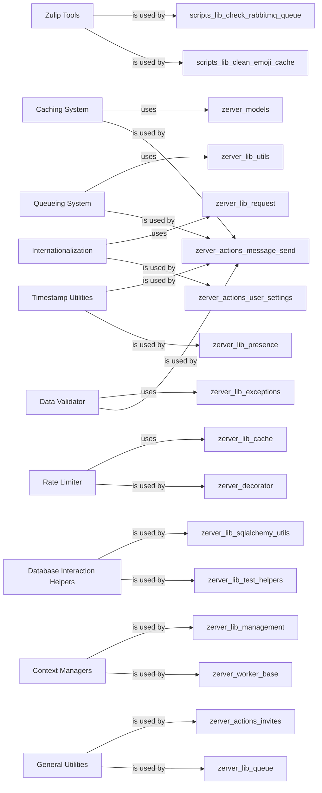

## Component Details

This broad component encompasses foundational services and helper functions that are utilized across almost all other parts of the Zulip application. These components are fundamental because they provide essential, low-level functionalities that ensure the application's performance, reliability, security, and maintainability. They abstract away common complexities, promote code reuse, and enforce consistent behavior across the system.

### Zulip Tools
This component provides a collection of essential utility functions primarily used for system-level operations, deployment management, version parsing, and user privilege handling (e.g., `run_as_root`). It acts as a foundational layer for various administrative and maintenance scripts. Its centrality lies in providing core system-level functionalities crucial for the operation and maintenance of the Zulip server.

**Related Classes/Methods**:

- <a href="https://github.com/zulip/zulip/blob/master/scripts/lib/zulip_tools.py#L0-L0" target="_blank" rel="noopener noreferrer">`scripts.lib.zulip_tools` (0:0)</a>

### Caching System
This is a core caching mechanism responsible for storing and retrieving frequently accessed data to improve application performance. It handles cache key generation, validation, setting, getting, and deleting cached items, including user profiles, realms, streams, and messages. It supports both in-memory (via `functools.lru_cache`) and potentially remote caching backends. It also includes helper functions (`zerver.lib.cache_helpers`) that streamline common caching patterns for efficient data population and retrieval. It is fundamental for optimizing database queries and reducing load, directly impacting application responsiveness.

**Related Classes/Methods**:

- <a href="https://github.com/zulip/zulip/blob/master/zerver/lib/cache.py#L0-L0" target="_blank" rel="noopener noreferrer">`zerver.lib.cache` (0:0)</a>
- <a href="https://github.com/zulip/zulip/blob/master/zerver/lib/cache_helpers.py#L0-L0" target="_blank" rel="noopener noreferrer">`zerver.lib.cache_helpers` (0:0)</a>

### Internationalization
This component manages all aspects of internationalization (i18n) within the application. It provides functionalities for retrieving available languages, language names, and determining the appropriate language for user requests, including default languages for new and anonymous users. It leverages caching for language lists. This is fundamental for supporting a global user base and providing a localized experience.

**Related Classes/Methods**:

- <a href="https://github.com/zulip/zulip/blob/master/zerver/lib/i18n.py#L0-L0" target="_blank" rel="noopener noreferrer">`zerver.lib.i18n` (0:0)</a>

### Queueing System
This component is responsible for asynchronous task processing and inter-process communication using message queues. It defines client interfaces for connecting to queues, publishing messages (including JSON payloads), and starting consumers to process queued events. It supports different queue client implementations (e.g., `SimpleQueueClient`, `TornadoQueueClient`). It is fundamental for offloading long-running tasks, improving user experience by making operations non-blocking, and enabling scalable background processing.

**Related Classes/Methods**:

- <a href="https://github.com/zulip/zulip/blob/master/zerver/lib/queue.py#L0-L0" target="_blank" rel="noopener noreferrer">`zerver.lib.queue` (0:0)</a>

### Rate Limiter
This component enforces rate limits on various entities such as users, IP addresses, and API endpoints to prevent abuse and ensure fair resource allocation. It defines rules for limiting API calls within specified windows and provides mechanisms to check limits, block/unblock access, and clear history. It can operate with different backends (in-memory, Redis). It is fundamental for security and preventing denial-of-service attacks or resource exhaustion.

**Related Classes/Methods**:

- <a href="https://github.com/zulip/zulip/blob/master/zerver/lib/rate_limiter.py#L0-L0" target="_blank" rel="noopener noreferrer">`zerver.lib.rate_limiter` (0:0)</a>

### Timestamp Utilities
This component offers utility functions for handling and manipulating timestamps. It ensures consistency by verifying UTC timezone for datetime objects and provides methods for flooring and ceiling timestamps to specific granularities (e.g., hour, day). It is fundamental for maintaining data integrity related to time, ensuring consistent behavior across different time zones, and simplifying time-based calculations.

**Related Classes/Methods**:

- <a href="https://github.com/zulip/zulip/blob/master/zerver/lib/timestamp.py#L0-L0" target="_blank" rel="noopener noreferrer">`zerver.lib.timestamp` (0:0)</a>

### Data Validator
This component provides a comprehensive set of validation functions for various data types and structures. It ensures data integrity and correctness by validating strings, integers, dictionaries, URLs, and complex data formats. It also includes `WildValue` for flexible and safe access to potentially malformed data. It is fundamental for maintaining data quality, preventing errors, and ensuring the security of input data.

**Related Classes/Methods**:

- <a href="https://github.com/zulip/zulip/blob/master/zerver/lib/validator.py#L0-L0" target="_blank" rel="noopener noreferrer">`zerver.lib.validator` (0:0)</a>

### Database Interaction Helpers
This component provides low-level helper functions for interacting with the database, likely abstracting common database operations or providing utilities for database-related tasks. It is fundamental as it centralizes database access logic, promoting consistency and simplifying database interactions for other parts of the application.

**Related Classes/Methods**:

- <a href="https://github.com/zulip/zulip/blob/master/zerver/lib/db.py#L0-L0" target="_blank" rel="noopener noreferrer">`zerver.lib.db` (0:0)</a>

### Context Managers
This component provides reusable context managers to simplify resource management and ensure proper setup and teardown of resources within the application, particularly for management commands and worker processes. It is fundamental for ensuring resource safety and simplifying error handling by automatically managing resource allocation and deallocation.

**Related Classes/Methods**:

- <a href="https://github.com/zulip/zulip/blob/master/zerver/lib/context_managers.py#L0-L0" target="_blank" rel="noopener noreferrer">`zerver.lib.context_managers` (0:0)</a>

### General Utilities
This is a broad collection of miscellaneous utility functions that are widely used across the Zulip application for various common tasks, such as string manipulation, data processing, and other general-purpose helpers. It is fundamental because it provides a centralized location for common, non-domain-specific helper functions, reducing code duplication and improving code readability and maintainability.

**Related Classes/Methods**:

- <a href="https://github.com/zulip/zulip/blob/master/zerver/lib/utils.py#L0-L0" target="_blank" rel="noopener noreferrer">`zerver.lib.utils` (0:0)</a>

### [FAQ](https://github.com/CodeBoarding/GeneratedOnBoardings/tree/main?tab=readme-ov-file#faq)