```mermaid
graph LR
    Data_Import_Subsystem["Data Import Subsystem"]
    Data_Export_Subsystem["Data Export Subsystem"]
    Upload_Management["Upload Management"]
    Thumbnail_Generation["Thumbnail Generation"]
    Incoming_Webhooks["Incoming Webhooks"]
    Outgoing_Webhooks["Outgoing Webhooks"]
    Integrations_Framework["Integrations Framework"]
    Models_Database_Interaction["Models/Database Interaction"]
    Queueing_System["Queueing System"]
    Message_Sending_Processing["Message Sending/Processing"]
    Data_Import_Subsystem -- "Interacts with" --> Models_Database_Interaction
    Data_Import_Subsystem -- "Uses" --> Upload_Management
    Data_Import_Subsystem -- "Leverages" --> Queueing_System
    Data_Export_Subsystem -- "Interacts with" --> Models_Database_Interaction
    Data_Export_Subsystem -- "Leverages" --> Queueing_System
    Upload_Management -- "Interacts with" --> Models_Database_Interaction
    Upload_Management -- "Requests" --> Thumbnail_Generation
    Thumbnail_Generation -- "Leverages" --> Queueing_System
    Incoming_Webhooks -- "Utilizes" --> Integrations_Framework
    Incoming_Webhooks -- "Uses" --> Message_Sending_Processing
    Incoming_Webhooks -- "Interacts with" --> Models_Database_Interaction
    Outgoing_Webhooks -- "Utilizes" --> Integrations_Framework
    Outgoing_Webhooks -- "Leverages" --> Queueing_System
    Outgoing_Webhooks -- "Interacts with" --> Message_Sending_Processing
    Integrations_Framework -- "Defines" --> Incoming_Webhooks
    Integrations_Framework -- "Defines" --> Outgoing_Webhooks
    Message_Sending_Processing -- "Interacts heavily with" --> Models_Database_Interaction
    Message_Sending_Processing -- "Relies on" --> Queueing_System
    Queueing_System -- "Processes tasks for" --> Data_Import_Subsystem
    Queueing_System -- "Processes tasks for" --> Data_Export_Subsystem
    Queueing_System -- "Processes tasks for" --> Upload_Management
    Queueing_System -- "Processes tasks for" --> Thumbnail_Generation
    Queueing_System -- "Processes tasks for" --> Outgoing_Webhooks
```

## Component Details

This component is the backbone for all data ingress, egress, and external service interactions within Zulip. It ensures seamless integration with various platforms for chat history and user data, provides robust mechanisms for data backup and migration, and facilitates real-time communication with external services through webhooks.

### Data Import Subsystem
Manages the migration of chat history and user data from external platforms (e.g., Slack, Mattermost, Rocket.Chat) into Zulip. It handles parsing diverse external data formats, mapping them to Zulip's internal data models, and persisting them in the database and file storage.

**Related Classes/Methods**:

- <a href="https://github.com/zulip/zulip/blob/master/zerver/data_import/import_util.py#L0-L0" target="_blank" rel="noopener noreferrer">`zerver.data_import.import_util` (0:0)</a>
- <a href="https://github.com/zulip/zulip/blob/master/zerver/data_import/slack.py#L0-L0" target="_blank" rel="noopener noreferrer">`zerver.data_import.slack` (0:0)</a>
- <a href="https://github.com/zulip/zulip/blob/master/zerver/data_import/mattermost.py#L0-L0" target="_blank" rel="noopener noreferrer">`zerver.data_import.mattermost` (0:0)</a>
- <a href="https://github.com/zulip/zulip/blob/master/zerver/data_import/rocketchat.py#L0-L0" target="_blank" rel="noopener noreferrer">`zerver.data_import.rocketchat` (0:0)</a>
- <a href="https://github.com/zulip/zulip/blob/master/zerver/management/commands/import.py#L0-L0" target="_blank" rel="noopener noreferrer">`zerver.management.commands.import` (0:0)</a>

### Data Export Subsystem
Provides functionality for exporting Zulip data, enabling administrators to create backups or migrate data out of a Zulip instance. It can export various data types, including realm configurations, user profiles, messages, and attachments.

**Related Classes/Methods**:

- <a href="https://github.com/zulip/zulip/blob/master/zerver/lib/export.py#L0-L0" target="_blank" rel="noopener noreferrer">`zerver.lib.export` (0:0)</a>
- <a href="https://github.com/zulip/zulip/blob/master/zerver/management/commands/export.py#L0-L0" target="_blank" rel="noopener noreferrer">`zerver.management.commands.export` (0:0)</a>

### Upload Management
Handles the secure storage, retrieval, and deletion of user-uploaded files and media (e.g., message attachments, user avatars, realm icons, custom emojis). It abstracts the underlying storage mechanism, supporting both local filesystem and cloud storage (e.g., Amazon S3).

**Related Classes/Methods**:

- <a href="https://github.com/zulip/zulip/blob/master/zerver/lib/upload/base.py#L0-L0" target="_blank" rel="noopener noreferrer">`zerver.lib.upload.base` (0:0)</a>
- <a href="https://github.com/zulip/zulip/blob/master/zerver/lib/upload/local.py#L0-L0" target="_blank" rel="noopener noreferrer">`zerver.lib.upload.local` (0:0)</a>
- <a href="https://github.com/zulip/zulip/blob/master/zerver/lib/upload/s3.py#L0-L0" target="_blank" rel="noopener noreferrer">`zerver.lib.upload.s3` (0:0)</a>
- <a href="https://github.com/zulip/zulip/blob/master/zerver/actions/uploads.py#L0-L0" target="_blank" rel="noopener noreferrer">`zerver.actions.uploads` (0:0)</a>
- <a href="https://github.com/zulip/zulip/blob/master/zerver/views/upload.py#L0-L0" target="_blank" rel="noopener noreferrer">`zerver.views.upload` (0:0)</a>

### Thumbnail Generation
Responsible for generating optimized image thumbnails for uploaded files. This improves application performance and user experience by displaying smaller, pre-processed images where appropriate.

**Related Classes/Methods**:

- <a href="https://github.com/zulip/zulip/blob/master/zerver/lib/thumbnail.py#L0-L0" target="_blank" rel="noopener noreferrer">`zerver.lib.thumbnail` (0:0)</a>
- <a href="https://github.com/zulip/zulip/blob/master/zerver/worker/thumbnail.py#L0-L0" target="_blank" rel="noopener noreferrer">`zerver.worker.thumbnail` (0:0)</a>

### Incoming Webhooks
Manages the reception and processing of incoming webhook requests from a wide array of external services (e.g., GitHub, Jira, Slack). It parses the incoming payload, transforms it into a Zulip message format, and then dispatches the message to the appropriate stream or user.

**Related Classes/Methods**:

- <a href="https://github.com/zulip/zulip/blob/master/zerver/lib/webhooks/common.py#L0-L0" target="_blank" rel="noopener noreferrer">`zerver.lib.webhooks.common` (0:0)</a>
- `zerver.views.webhooks` (0:0)
- <a href="https://github.com/zulip/zulip/blob/master/zerver/webhooks/github/view.py#L0-L0" target="_blank" rel="noopener noreferrer">`zerver.webhooks.github.view` (0:0)</a>
- <a href="https://github.com/zulip/zulip/blob/master/zerver/webhooks/jira/view.py#L0-L0" target="_blank" rel="noopener noreferrer">`zerver.webhooks.jira.view` (0:0)</a>
- <a href="https://github.com/zulip/zulip/blob/master/zerver/webhooks/slack/view.py#L0-L0" target="_blank" rel="noopener noreferrer">`zerver.webhooks.slack.view` (0:0)</a>

### Outgoing Webhooks
Handles the sending of outgoing webhook requests from Zulip to external services. This includes constructing HTTP requests, sending them, processing responses, and managing retries for reliable delivery.

**Related Classes/Methods**:

- <a href="https://github.com/zulip/zulip/blob/master/zerver/lib/outgoing_webhook.py#L0-L0" target="_blank" rel="noopener noreferrer">`zerver.lib.outgoing_webhook` (0:0)</a>
- <a href="https://github.com/zulip/zulip/blob/master/zerver/worker/outgoing_webhooks.py#L0-L0" target="_blank" rel="noopener noreferrer">`zerver.worker.outgoing_webhooks` (0:0)</a>

### Integrations Framework
Provides a standardized and extensible framework for defining and managing various types of integrations within Zulip, including bots, Python API integrations, and webhooks. It establishes common properties and behaviors for different integration types, promoting reusability and maintainability.

**Related Classes/Methods**:

- <a href="https://github.com/zulip/zulip/blob/master/zerver/lib/integrations.py#L0-L0" target="_blank" rel="noopener noreferrer">`zerver.lib.integrations` (0:0)</a>

### Models/Database Interaction
Defines the data models for all Zulip entities (users, realms, streams, messages, attachments, etc.) and provides the interface for interacting with the underlying database. It's a foundational layer that ensures data consistency and persistence across the application.

**Related Classes/Methods**:

- <a href="https://github.com/zulip/zulip/blob/master/zerver/models/users.py#L0-L0" target="_blank" rel="noopener noreferrer">`zerver.models.users` (0:0)</a>
- <a href="https://github.com/zulip/zulip/blob/master/zerver/models/messages.py#L0-L0" target="_blank" rel="noopener noreferrer">`zerver.models.messages` (0:0)</a>
- `zerver.models.attachments` (0:0)
- <a href="https://github.com/zulip/zulip/blob/master/zerver/models/realms.py#L0-L0" target="_blank" rel="noopener noreferrer">`zerver.models.realms` (0:0)</a>
- <a href="https://github.com/zulip/zulip/blob/master/zerver/models/streams.py#L0-L0" target="_blank" rel="noopener noreferrer">`zerver.models.streams` (0:0)</a>

### Queueing System
Implements an asynchronous task queue mechanism, offloading long-running or background tasks (such as data imports/exports, thumbnail generation, and webhook processing) from the main application thread. This significantly improves application responsiveness and scalability.

**Related Classes/Methods**:

- <a href="https://github.com/zulip/zulip/blob/master/zerver/lib/queue.py#L0-L0" target="_blank" rel="noopener noreferrer">`zerver.lib.queue` (0:0)</a>
- <a href="https://github.com/zulip/zulip/blob/master/zerver/worker/queue_processors.py#L0-L0" target="_blank" rel="noopener noreferrer">`zerver.worker.queue_processors` (0:0)</a>
- <a href="https://github.com/zulip/zulip/blob/master/zerver/worker/thumbnail.py#L0-L0" target="_blank" rel="noopener noreferrer">`zerver.worker.thumbnail` (0:0)</a>
- <a href="https://github.com/zulip/zulip/blob/master/zerver/worker/outgoing_webhooks.py#L0-L0" target="_blank" rel="noopener noreferrer">`zerver.worker.outgoing_webhooks` (0:0)</a>

### Message Sending/Processing
Encapsulates the core logic for sending and processing messages within Zulip. This includes message formatting, recipient resolution, and interaction with the message storage and delivery mechanisms.

**Related Classes/Methods**:

- <a href="https://github.com/zulip/zulip/blob/master/zerver/actions/message_send.py#L0-L0" target="_blank" rel="noopener noreferrer">`zerver.actions.message_send` (0:0)</a>
- <a href="https://github.com/zulip/zulip/blob/master/zerver/lib/message.py#L0-L0" target="_blank" rel="noopener noreferrer">`zerver.lib.message` (0:0)</a>
- <a href="https://github.com/zulip/zulip/blob/master/zerver/lib/message_cache.py#L0-L0" target="_blank" rel="noopener noreferrer">`zerver.lib.message_cache` (0:0)</a>

### [FAQ](https://github.com/CodeBoarding/GeneratedOnBoardings/tree/main?tab=readme-ov-file#faq)