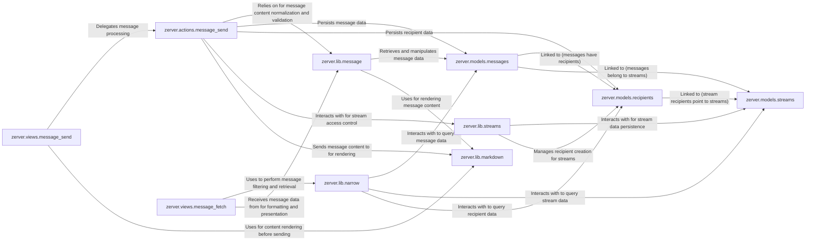

## Component Details

The `Messaging & Conversation Core` subsystem in Zulip is the central communication engine, managing the entire lifecycle of messages from sending and editing to displaying them within structured conversations (streams and topics) and direct messages. It also handles message content processing, including Markdown rendering, mentions, and emoji.

### zerver.views.message_send
This component provides the API endpoint that users interact with to send messages. It acts as the initial entry point for all message sending requests, performing preliminary validation and then delegating the core business logic to `zerver.actions.message_send`.

**Related Classes/Methods**:

- <a href="https://github.com/zulip/zulip/blob/master/zerver/views/message_send.py#L1-L1" target="_blank" rel="noopener noreferrer">`zerver/views/message_send.py` (1:1)</a>

### zerver.actions.message_send
This is the core business logic orchestrator for message processing. It handles message validation, content rendering, recipient resolution, persistence to the database, and triggering subsequent actions like notifications.

**Related Classes/Methods**:

- <a href="https://github.com/zulip/zulip/blob/master/zerver/actions/message_send.py#L1-L1" target="_blank" rel="noopener noreferrer">`zerver/actions/message_send.py` (1:1)</a>

### zerver.views.message_fetch
This component exposes API endpoints for retrieving messages. It processes client requests for message history, applying various search and narrowing parameters, and then utilizes `zerver.lib.narrow` to fetch the relevant messages.

**Related Classes/Methods**:

- <a href="https://github.com/zulip/zulip/blob/master/zerver/views/message_fetch.py#L1-L1" target="_blank" rel="noopener noreferrer">`zerver/views/message_fetch.py` (1:1)</a>

### zerver.models.messages
This component defines the Django ORM models for `Message` (the actual message content) and `UserMessage` (user-specific metadata and flags for each message). It is the primary data store for all conversation content.

**Related Classes/Methods**:

- <a href="https://github.com/zulip/zulip/blob/master/zerver/models/messages.py#L1-L1" target="_blank" rel="noopener noreferrer">`zerver/models/messages.py` (1:1)</a>

### zerver.lib.message
This library provides a suite of utility functions for various message-related operations, including content normalization, access control checks, and retrieving message data. It acts as a central library for consistent message handling logic across the application.

**Related Classes/Methods**:

- <a href="https://github.com/zulip/zulip/blob/master/zerver/lib/message.py#L1-L1" target="_blank" rel="noopener noreferrer">`zerver/lib/message.py` (1:1)</a>

### zerver.lib.narrow
This component implements the sophisticated logic for filtering and searching messages based on various criteria (e.g., streams, topics, senders, keywords). It constructs and executes database queries to efficiently retrieve relevant messages.

**Related Classes/Methods**:

- <a href="https://github.com/zulip/zulip/blob/master/zerver/lib/narrow.py#L1-L1" target="_blank" rel="noopener noreferrer">`zerver/lib/narrow.py` (1:1)</a>

### zerver.lib.markdown
Responsible for converting message content from Markdown format into HTML for display. It supports various Markdown extensions and Zulip-specific features like mentions and emoji, ensuring messages are rendered correctly.

**Related Classes/Methods**:

- <a href="https://github.com/zulip/zulip/blob/master/zerver/lib/markdown/__init__.py#L1-L1" target="_blank" rel="noopener noreferrer">`zerver/lib/markdown/__init__.py` (1:1)</a>

### zerver.models.streams
This component defines the Django ORM model for `Stream`, which represents a channel or public/private conversation. It stores metadata about streams, including their name, description, and access policies.

**Related Classes/Methods**:

- <a href="https://github.com/zulip/zulip/blob/master/zerver/models/streams.py#L1-L1" target="_blank" rel="noopener noreferrer">`zerver/models/streams.py` (1:1)</a>

### zerver.models.recipients
This component defines the Django ORM model for `Recipient`, which links messages to their intended destinations (streams, private message groups, or direct messages). It also defines `DirectMessageGroup` for group DMs.

**Related Classes/Methods**:

- <a href="https://github.com/zulip/zulip/blob/master/zerver/models/recipients.py#L1-L1" target="_blank" rel="noopener noreferrer">`zerver/models/recipients.py` (1:1)</a>

### zerver.lib.streams
This library manages all operations related to streams, including their creation, subscription management, access control, and retrieval. It ensures proper permissions and data integrity for stream-based conversations.

**Related Classes/Methods**:

- <a href="https://github.com/zulip/zulip/blob/master/zerver/lib/streams.py#L1-L1" target="_blank" rel="noopener noreferrer">`zerver/lib/streams.py` (1:1)</a>

### [FAQ](https://github.com/CodeBoarding/GeneratedOnBoardings/tree/main?tab=readme-ov-file#faq)