```mermaid
graph LR
    zerver_lib_events["zerver.lib.events"]
    zerver_tornado_event_queue["zerver.tornado.event_queue"]
    zerver_tornado_django_api["zerver.tornado.django_api"]
    zerver_lib_queue["zerver.lib.queue"]
    zerver_worker_base["zerver.worker.base"]
    zerver_worker_missedmessage_emails["zerver.worker.missedmessage_emails"]
    zerver_worker_missedmessage_mobile_notifications["zerver.worker.missedmessage_mobile_notifications"]
    zerver_lib_push_notifications["zerver.lib.push_notifications"]
    zerver_lib_email_notifications["zerver.lib.email_notifications"]
    zerver_lib_events -- "generates events that are consumed by" --> zerver_tornado_django_api
    zerver_tornado_django_api -- "sends events to" --> zerver_tornado_event_queue
    zerver_tornado_django_api -- "utilizes to enqueue asynchronous tasks" --> zerver_lib_queue
    zerver_tornado_event_queue -- "uses to manage its event queues" --> zerver_lib_queue
    zerver_lib_queue -- "enqueues tasks for" --> zerver_worker_missedmessage_emails
    zerver_lib_queue -- "enqueues tasks for" --> zerver_worker_missedmessage_mobile_notifications
    zerver_worker_missedmessage_emails -- "extends" --> zerver_worker_base
    zerver_worker_missedmessage_emails -- "uses to send emails" --> zerver_lib_email_notifications
    zerver_worker_missedmessage_mobile_notifications -- "extends" --> zerver_worker_base
    zerver_worker_missedmessage_mobile_notifications -- "uses to send mobile notifications" --> zerver_lib_push_notifications
    zerver_lib_email_notifications -- "enqueues email sending tasks to" --> zerver_lib_queue
    zerver_lib_push_notifications -- "enqueues push notification tasks to" --> zerver_lib_queue
```

## Component Details

This component forms the real-time backbone of Zulip, responsible for delivering events to connected clients (e.g., web, desktop, mobile) and sending various types of notifications (email, mobile push). It manages event queues to ensure timely and reliable delivery of updates based on user actions and system changes, enabling the live, collaborative experience.

### zerver.lib.events
This module is the central hub for event generation and processing. It defines the structure of various event types and provides functions to register and dispatch events to the Tornado event queue. It acts as the primary interface for other parts of the application to signal changes that need to be propagated to clients or trigger notifications.

**Related Classes/Methods**:

- <a href="https://github.com/zulip/zulip/blob/master/zerver/lib/events.py#L0-L0" target="_blank" rel="noopener noreferrer">`zerver.lib.events` (0:0)</a>

### zerver.tornado.event_queue
This module manages the long-polling event queues for connected clients. It stores events generated by `zerver.lib.events` and delivers them to clients as they poll for updates. It's crucial for maintaining the real-time nature of Zulip's UI.

**Related Classes/Methods**:

- <a href="https://github.com/zulip/zulip/blob/master/zerver/tornado/event_queue.py#L0-L0" target="_blank" rel="noopener noreferrer">`zerver.tornado.event_queue` (0:0)</a>

### zerver.tornado.django_api
This module acts as a bridge between the Django application (where most business logic resides) and the Tornado event queue. It provides functions that Django can call to add events to the Tornado event queue, ensuring that actions performed in Django are reflected in real-time for connected clients.

**Related Classes/Methods**:

- <a href="https://github.com/zulip/zulip/blob/master/zerver/tornado/django_api.py#L0-L0" target="_blank" rel="noopener noreferrer">`zerver.tornado.django_api` (0:0)</a>

### zerver.lib.queue
This module provides a generic queuing mechanism used throughout Zulip for asynchronous task processing. In the context of real-time events and notifications, it's used to enqueue tasks like sending emails, mobile push notifications, and processing other deferred work, ensuring that these operations don't block the main request-response cycle.

**Related Classes/Methods**:

- <a href="https://github.com/zulip/zulip/blob/master/zerver/lib/queue.py#L0-L0" target="_blank" rel="noopener noreferrer">`zerver.lib.queue` (0:0)</a>

### zerver.worker.base
This module provides the foundational classes and utilities for all background workers in Zulip. It handles common concerns like database connections, per-request caching, and error handling for asynchronous tasks.

**Related Classes/Methods**:

- <a href="https://github.com/zulip/zulip/blob/master/zerver/worker/base.py#L0-L0" target="_blank" rel="noopener noreferrer">`zerver.worker.base` (0:0)</a>

### zerver.worker.missedmessage_emails
This worker is responsible for processing the queue of missed message email notifications. It aggregates missed messages for users and sends out digest emails, ensuring users are informed of activity they missed while offline or away.

**Related Classes/Methods**:

- <a href="https://github.com/zulip/zulip/blob/master/zerver/worker/missedmessage_emails.py#L0-L0" target="_blank" rel="noopener noreferrer">`zerver.worker.missedmessage_emails` (0:0)</a>

### zerver.worker.missedmessage_mobile_notifications
This worker handles the sending of mobile push notifications for missed messages. It interacts with external push notification services to deliver real-time alerts to mobile devices.

**Related Classes/Methods**:

- <a href="https://github.com/zulip/zulip/blob/master/zerver/worker/missedmessage_mobile_notifications.py#L0-L0" target="_blank" rel="noopener noreferrer">`zerver.worker.missedmessage_mobile_notifications` (0:0)</a>

### zerver.lib.push_notifications
This module provides the core logic for generating and sending mobile push notifications. It formats the notification payload and interacts with the push notification worker to dispatch these alerts.

**Related Classes/Methods**:

- <a href="https://github.com/zulip/zulip/blob/master/zerver/lib/push_notifications.py#L0-L0" target="_blank" rel="noopener noreferrer">`zerver.lib.push_notifications` (0:0)</a>

### zerver.lib.email_notifications
This module contains the logic for generating and sending various types of email notifications, including missed message emails and digest emails. It formats the email content and enqueues them for sending by the email sender workers.

**Related Classes/Methods**:

- <a href="https://github.com/zulip/zulip/blob/master/zerver/lib/email_notifications.py#L0-L0" target="_blank" rel="noopener noreferrer">`zerver.lib.email_notifications` (0:0)</a>

### [FAQ](https://github.com/CodeBoarding/GeneratedOnBoardings/tree/main?tab=readme-ov-file#faq)