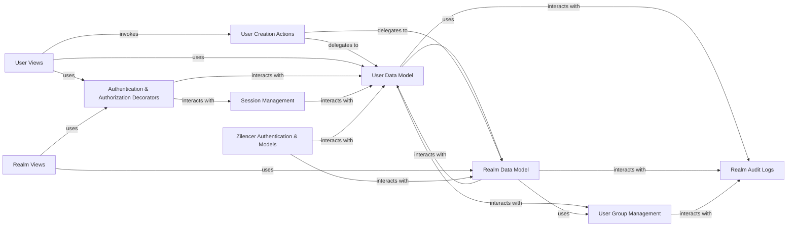

## Component Details

This foundational component manages all aspects of user accounts, organizations (realms), and their associated settings within Zulip. It handles user creation, modification, deactivation, role assignments, and the configuration of realm-wide policies. Crucially, it also encompasses authentication and authorization, securing access through user logins (password, SSO), API key validation, and enforcing granular permissions across the application.

### User Data Model
This class defines the core data structure for individual user profiles within Zulip. It stores essential user information such as email addresses, full names, roles (e.g., administrator, member, guest), API keys, and various personal settings. It serves as the foundational representation of a user in the system.

**Related Classes/Methods**:

- <a href="https://github.com/zulip/zulip/blob/master/zerver/models/users.py#L425-L922" target="_blank" rel="noopener noreferrer">`zerver.models.users.UserProfile` (425:922)</a>

### Realm Data Model
This class defines the core data structures for organizations or "realms" in Zulip. It encapsulates all realm-wide settings, policies (e.g., message retention, authentication methods, emoji policies), and overall configuration. It is the central representation of an organization within the application.

**Related Classes/Methods**:

- <a href="https://github.com/zulip/zulip/blob/master/zerver/models/realms.py#L157-L1236" target="_blank" rel="noopener noreferrer">`zerver.models.realms.Realm` (157:1236)</a>

### User Creation Actions
This module contains the business logic responsible for the creation of new user accounts. This includes setting initial user properties, assigning users to default channels (streams), and initiating welcome communications (e.g., welcome emails). It interacts heavily with the `UserProfile` and `Realm` models.

**Related Classes/Methods**:

- <a href="https://github.com/zulip/zulip/blob/master/zerver/actions/create_user.py#L1-L1" target="_blank" rel="noopener noreferrer">`zerver.actions.create_user` (1:1)</a>

### User Views
This module provides the API endpoints that allow clients to perform user-related operations. This includes fetching lists of users, retrieving and updating individual user profiles, and managing user status (e.g., deactivation). It acts as the interface between the client-side application and the backend user management logic.

**Related Classes/Methods**:

- <a href="https://github.com/zulip/zulip/blob/master/zerver/views/users.py#L1-L1" target="_blank" rel="noopener noreferrer">`zerver.views.users` (1:1)</a>

### Realm Views
This module exposes API endpoints for managing organization-wide settings and policies. This includes configuring authentication methods, setting message retention policies, and managing custom profile fields for the entire realm. It provides the administrative interface for realm configuration.

**Related Classes/Methods**:

- <a href="https://github.com/zulip/zulip/blob/master/zerver/views/realm.py#L1-L1" target="_blank" rel="noopener noreferrer">`zerver.views.realm` (1:1)</a>

### Authentication & Authorization Decorators
This module provides a collection of decorators that are applied to various view functions across the application. These decorators are crucial for enforcing security policies, including user authentication, role-based authorization (checking `UserProfile` roles and `Realm` permissions), and rate limiting to prevent abuse.

**Related Classes/Methods**:

- <a href="https://github.com/zulip/zulip/blob/master/zerver/decorator.py#L1-L1" target="_blank" rel="noopener noreferrer">`zerver.decorator` (1:1)</a>

### Session Management
This module is responsible for managing user login sessions. It handles the creation, validation, and termination of sessions, ensuring secure and persistent access for authenticated users across their interactions with the application. It relies on `UserProfile` for user identification.

**Related Classes/Methods**:

- <a href="https://github.com/zulip/zulip/blob/master/zerver/lib/sessions.py#L1-L1" target="_blank" rel="noopener noreferrer">`zerver.lib.sessions` (1:1)</a>

### User Group Management
This module provides the core logic for creating, modifying, and managing user groups within realms. These groups are fundamental for defining granular permissions and implementing role-based access control throughout the application, often referenced by `Realm` policies.

**Related Classes/Methods**:

- <a href="https://github.com/zulip/zulip/blob/master/zerver/lib/user_groups.py#L1-L1" target="_blank" rel="noopener noreferrer">`zerver.lib.user_groups` (1:1)</a>

### Realm Audit Logs
This class defines the data model for storing a historical record of significant administrative actions and changes related to users and realms. This audit trail is crucial for security, compliance, and debugging purposes, recording changes to `UserProfile` and `Realm` data.

**Related Classes/Methods**:

- <a href="https://github.com/zulip/zulip/blob/master/zerver/models/realm_audit_logs.py#L202-L298" target="_blank" rel="noopener noreferrer">`zerver.models.realm_audit_logs.RealmAuditLog` (202:298)</a>

### Zilencer Authentication & Models
The `zilencer.auth` module handles authentication mechanisms specifically for the `zilencer` application, often dealing with remote server interactions and billing. It validates API keys and other credentials for remote Zulip instances. The `zilencer.models` module defines data models like `RemoteZulipServer` (for managing connections to other Zulip instances) and `RemotePushDeviceToken` (for handling push notifications across different server deployments), which are essential for supporting multi-server architectures and remote interactions related to user and organization data.

**Related Classes/Methods**:

- <a href="https://github.com/zulip/zulip/blob/master/zilencer/auth.py#L1-L1" target="_blank" rel="noopener noreferrer">`zilencer.auth` (1:1)</a>
- <a href="https://github.com/zulip/zulip/blob/master/zilencer/models.py#L1-L1" target="_blank" rel="noopener noreferrer">`zilencer.models` (1:1)</a>

### [FAQ](https://github.com/CodeBoarding/GeneratedOnBoardings/tree/main?tab=readme-ov-file#faq)