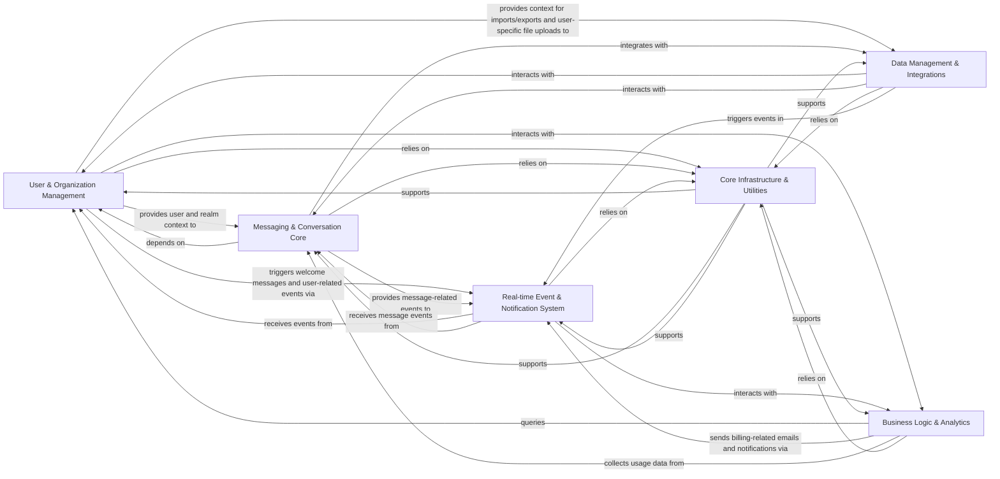

## Component Details

The Zulip architecture is designed around a modular approach, enabling robust real-time communication, extensive user and organization management, and flexible integration capabilities. The core components are strategically separated to manage distinct functionalities while maintaining clear interaction pathways.

### User & Organization Management
This foundational component manages all aspects of user accounts, organizations (realms), and their associated settings. It handles user creation, modification, deactivation, role assignments, and the configuration of realm-wide policies. Crucially, it also encompasses authentication and authorization, securing access through user logins (password, SSO), API key validation, and enforcing granular permissions across the application.

**Related Classes/Methods**:

- <a href="https://github.com/zulip/zulip/blob/master/zerver/models/users.py#L0-L0" target="_blank" rel="noopener noreferrer">`zerver.models.users` (0:0)</a>
- <a href="https://github.com/zulip/zulip/blob/master/zerver/models/realms.py#L0-L0" target="_blank" rel="noopener noreferrer">`zerver.models.realms` (0:0)</a>
- <a href="https://github.com/zulip/zulip/blob/master/zerver/actions/create_user.py#L0-L0" target="_blank" rel="noopener noreferrer">`zerver.actions.create_user` (0:0)</a>
- <a href="https://github.com/zulip/zulip/blob/master/zerver/views/users.py#L0-L0" target="_blank" rel="noopener noreferrer">`zerver.views.users` (0:0)</a>
- <a href="https://github.com/zulip/zulip/blob/master/zerver/views/realm.py#L0-L0" target="_blank" rel="noopener noreferrer">`zerver.views.realm` (0:0)</a>
- <a href="https://github.com/zulip/zulip/blob/master/zproject/backends.py#L0-L0" target="_blank" rel="noopener noreferrer">`zproject.backends` (0:0)</a>
- <a href="https://github.com/zulip/zulip/blob/master/zerver/decorator.py#L0-L0" target="_blank" rel="noopener noreferrer">`zerver.decorator` (0:0)</a>
- <a href="https://github.com/zulip/zulip/blob/master/confirmation/models.py#L0-L0" target="_blank" rel="noopener noreferrer">`confirmation.models` (0:0)</a>
- <a href="https://github.com/zulip/zulip/blob/master/zerver/lib/sessions.py#L0-L0" target="_blank" rel="noopener noreferrer">`zerver.lib.sessions` (0:0)</a>
- <a href="https://github.com/zulip/zulip/blob/master/zilencer/auth.py#L0-L0" target="_blank" rel="noopener noreferrer">`zilencer.auth` (0:0)</a>

### Messaging & Conversation Core
This is the central communication engine of Zulip. It manages the entire lifecycle of messages, including sending, editing, deleting, and displaying them within structured conversations (streams and topics) and direct messages. It also handles the processing of message content, such as Markdown rendering, mentions, and emoji.

**Related Classes/Methods**:

- <a href="https://github.com/zulip/zulip/blob/master/zerver/actions/message_send.py#L0-L0" target="_blank" rel="noopener noreferrer">`zerver.actions.message_send` (0:0)</a>
- <a href="https://github.com/zulip/zulip/blob/master/zerver/models/messages.py#L0-L0" target="_blank" rel="noopener noreferrer">`zerver.models.messages` (0:0)</a>
- <a href="https://github.com/zulip/zulip/blob/master/zerver/models/streams.py#L0-L0" target="_blank" rel="noopener noreferrer">`zerver.models.streams` (0:0)</a>
- <a href="https://github.com/zulip/zulip/blob/master/zerver/models/recipients.py#L0-L0" target="_blank" rel="noopener noreferrer">`zerver.models.recipients` (0:0)</a>
- <a href="https://github.com/zulip/zulip/blob/master/zerver/models/user_topics.py#L0-L0" target="_blank" rel="noopener noreferrer">`zerver.models.user_topics` (0:0)</a>
- <a href="https://github.com/zulip/zulip/blob/master/zerver/models/muted_users.py#L0-L0" target="_blank" rel="noopener noreferrer">`zerver.models.muted_users` (0:0)</a>
- <a href="https://github.com/zulip/zulip/blob/master/zerver/lib/message.py#L0-L0" target="_blank" rel="noopener noreferrer">`zerver.lib.message` (0:0)</a>
- <a href="https://github.com/zulip/zulip/blob/master/zerver/lib/streams.py#L0-L0" target="_blank" rel="noopener noreferrer">`zerver.lib.streams` (0:0)</a>
- <a href="https://github.com/zulip/zulip/blob/master/zerver/lib/topic.py#L0-L0" target="_blank" rel="noopener noreferrer">`zerver.lib.topic` (0:0)</a>
- <a href="https://github.com/zulip/zulip/blob/master/zerver/lib/narrow.py#L0-L0" target="_blank" rel="noopener noreferrer">`zerver.lib.narrow` (0:0)</a>
- `zerver.lib.markdown` (0:0)
- <a href="https://github.com/zulip/zulip/blob/master/zerver/lib/mention.py#L0-L0" target="_blank" rel="noopener noreferrer">`zerver.lib.mention` (0:0)</a>
- <a href="https://github.com/zulip/zulip/blob/master/zerver/views/message_send.py#L0-L0" target="_blank" rel="noopener noreferrer">`zerver.views.message_send` (0:0)</a>
- <a href="https://github.com/zulip/zulip/blob/master/zerver/views/message_fetch.py#L0-L0" target="_blank" rel="noopener noreferrer">`zerver.views.message_fetch` (0:0)</a>
- <a href="https://github.com/zulip/zulip/blob/master/zerver/views/streams.py#L0-L0" target="_blank" rel="noopener noreferrer">`zerver.views.streams` (0:0)</a>

### Real-time Event & Notification System
This component forms the real-time backbone of Zulip, responsible for delivering events to connected clients (e.g., web, desktop, mobile) and sending various types of notifications (email, mobile push). It manages event queues to ensure timely and reliable delivery of updates based on user actions and system changes, enabling the live, collaborative experience.

**Related Classes/Methods**:

- <a href="https://github.com/zulip/zulip/blob/master/zerver/lib/events.py#L0-L0" target="_blank" rel="noopener noreferrer">`zerver.lib.events` (0:0)</a>
- <a href="https://github.com/zulip/zulip/blob/master/zerver/tornado/event_queue.py#L0-L0" target="_blank" rel="noopener noreferrer">`zerver.tornado.event_queue` (0:0)</a>
- <a href="https://github.com/zulip/zulip/blob/master/zerver/tornado/django_api.py#L0-L0" target="_blank" rel="noopener noreferrer">`zerver.tornado.django_api` (0:0)</a>
- <a href="https://github.com/zulip/zulip/blob/master/zerver/lib/queue.py#L0-L0" target="_blank" rel="noopener noreferrer">`zerver.lib.queue` (0:0)</a>
- <a href="https://github.com/zulip/zulip/blob/master/zerver/worker/base.py#L0-L0" target="_blank" rel="noopener noreferrer">`zerver.worker.base` (0:0)</a>
- <a href="https://github.com/zulip/zulip/blob/master/zerver/worker/missedmessage_emails.py#L0-L0" target="_blank" rel="noopener noreferrer">`zerver.worker.missedmessage_emails` (0:0)</a>
- <a href="https://github.com/zulip/zulip/blob/master/zerver/worker/missedmessage_mobile_notifications.py#L0-L0" target="_blank" rel="noopener noreferrer">`zerver.worker.missedmessage_mobile_notifications` (0:0)</a>
- <a href="https://github.com/zulip/zulip/blob/master/zerver/lib/push_notifications.py#L0-L0" target="_blank" rel="noopener noreferrer">`zerver.lib.push_notifications` (0:0)</a>
- <a href="https://github.com/zulip/zulip/blob/master/zerver/lib/email_notifications.py#L0-L0" target="_blank" rel="noopener noreferrer">`zerver.lib.email_notifications` (0:0)</a>

### Data Management & Integrations
This component handles all aspects of data ingress and egress, including importing chat history and user data from other platforms, exporting Zulip data for backup, and managing user-uploaded files and media (secure storage, thumbnail generation, serving). It also provides a flexible framework for Zulip to interact with a wide array of external services through incoming webhooks (e.g., GitHub, Jira) and outgoing webhooks.

**Related Classes/Methods**:

- <a href="https://github.com/zulip/zulip/blob/master/zerver/data_import/import_util.py#L0-L0" target="_blank" rel="noopener noreferrer">`zerver.data_import.import_util` (0:0)</a>
- <a href="https://github.com/zulip/zulip/blob/master/zerver/data_import/slack.py#L0-L0" target="_blank" rel="noopener noreferrer">`zerver.data_import.slack` (0:0)</a>
- <a href="https://github.com/zulip/zulip/blob/master/zerver/data_import/mattermost.py#L0-L0" target="_blank" rel="noopener noreferrer">`zerver.data_import.mattermost` (0:0)</a>
- <a href="https://github.com/zulip/zulip/blob/master/zerver/data_import/rocketchat.py#L0-L0" target="_blank" rel="noopener noreferrer">`zerver.data_import.rocketchat` (0:0)</a>
- <a href="https://github.com/zulip/zulip/blob/master/zerver/lib/export.py#L0-L0" target="_blank" rel="noopener noreferrer">`zerver.lib.export` (0:0)</a>
- <a href="https://github.com/zulip/zulip/blob/master/zerver/management/commands/import.py#L0-L0" target="_blank" rel="noopener noreferrer">`zerver.management.commands.import` (0:0)</a>
- <a href="https://github.com/zulip/zulip/blob/master/zerver/management/commands/export.py#L0-L0" target="_blank" rel="noopener noreferrer">`zerver.management.commands.export` (0:0)</a>
- <a href="https://github.com/zulip/zulip/blob/master/zerver/lib/upload/base.py#L0-L0" target="_blank" rel="noopener noreferrer">`zerver.lib.upload.base` (0:0)</a>
- <a href="https://github.com/zulip/zulip/blob/master/zerver/lib/upload/local.py#L0-L0" target="_blank" rel="noopener noreferrer">`zerver.lib.upload.local` (0:0)</a>
- <a href="https://github.com/zulip/zulip/blob/master/zerver/lib/upload/s3.py#L0-L0" target="_blank" rel="noopener noreferrer">`zerver.lib.upload.s3` (0:0)</a>
- <a href="https://github.com/zulip/zulip/blob/master/zerver/lib/thumbnail.py#L0-L0" target="_blank" rel="noopener noreferrer">`zerver.lib.thumbnail` (0:0)</a>
- <a href="https://github.com/zulip/zulip/blob/master/zerver/actions/uploads.py#L0-L0" target="_blank" rel="noopener noreferrer">`zerver.actions.uploads` (0:0)</a>
- <a href="https://github.com/zulip/zulip/blob/master/zerver/views/upload.py#L0-L0" target="_blank" rel="noopener noreferrer">`zerver.views.upload` (0:0)</a>
- <a href="https://github.com/zulip/zulip/blob/master/zerver/lib/webhooks/common.py#L0-L0" target="_blank" rel="noopener noreferrer">`zerver.lib.webhooks.common` (0:0)</a>
- <a href="https://github.com/zulip/zulip/blob/master/zerver/lib/integrations.py#L0-L0" target="_blank" rel="noopener noreferrer">`zerver.lib.integrations` (0:0)</a>
- <a href="https://github.com/zulip/zulip/blob/master/zerver/lib/outgoing_webhook.py#L0-L0" target="_blank" rel="noopener noreferrer">`zerver.lib.outgoing_webhook` (0:0)</a>
- `zerver.views.webhooks` (0:0)

### Business Logic & Analytics
This component manages Zulip's commercial aspects, including paid plans, customer subscriptions, invoicing, and license enforcement, often integrating with external payment gateways. Concurrently, it focuses on collecting, processing, and presenting usage statistics and activity data for both individual organizations and the overall Zulip installation, providing insights into user activity, message counts, and billing-related metrics.

**Related Classes/Methods**:

- <a href="https://github.com/zulip/zulip/blob/master/corporate/lib/stripe.py#L0-L0" target="_blank" rel="noopener noreferrer">`corporate.lib.stripe` (0:0)</a>
- <a href="https://github.com/zulip/zulip/blob/master/corporate/models/plans.py#L0-L0" target="_blank" rel="noopener noreferrer">`corporate.models.plans` (0:0)</a>
- <a href="https://github.com/zulip/zulip/blob/master/corporate/models/customers.py#L0-L0" target="_blank" rel="noopener noreferrer">`corporate.models.customers` (0:0)</a>
- <a href="https://github.com/zulip/zulip/blob/master/corporate/models/licenses.py#L0-L0" target="_blank" rel="noopener noreferrer">`corporate.models.licenses` (0:0)</a>
- <a href="https://github.com/zulip/zulip/blob/master/corporate/models/sponsorships.py#L0-L0" target="_blank" rel="noopener noreferrer">`corporate.models.sponsorships` (0:0)</a>
- <a href="https://github.com/zulip/zulip/blob/master/corporate/models/stripe_state.py#L0-L0" target="_blank" rel="noopener noreferrer">`corporate.models.stripe_state` (0:0)</a>
- <a href="https://github.com/zulip/zulip/blob/master/corporate/views/billing_page.py#L43-L89" target="_blank" rel="noopener noreferrer">`corporate.views.billing_page` (43:89)</a>
- <a href="https://github.com/zulip/zulip/blob/master/corporate/lib/registration.py#L0-L0" target="_blank" rel="noopener noreferrer">`corporate.lib.registration` (0:0)</a>
- <a href="https://github.com/zulip/zulip/blob/master/corporate/lib/activity.py#L0-L0" target="_blank" rel="noopener noreferrer">`corporate.lib.activity` (0:0)</a>
- <a href="https://github.com/zulip/zulip/blob/master/corporate/lib/support.py#L0-L0" target="_blank" rel="noopener noreferrer">`corporate.lib.support` (0:0)</a>
- <a href="https://github.com/zulip/zulip/blob/master/zilencer/models.py#L0-L0" target="_blank" rel="noopener noreferrer">`zilencer.models` (0:0)</a>
- <a href="https://github.com/zulip/zulip/blob/master/zilencer/views.py#L0-L0" target="_blank" rel="noopener noreferrer">`zilencer.views` (0:0)</a>
- <a href="https://github.com/zulip/zulip/blob/master/analytics/lib/counts.py#L0-L0" target="_blank" rel="noopener noreferrer">`analytics.lib.counts` (0:0)</a>
- <a href="https://github.com/zulip/zulip/blob/master/analytics/models.py#L0-L0" target="_blank" rel="noopener noreferrer">`analytics.models` (0:0)</a>
- <a href="https://github.com/zulip/zulip/blob/master/analytics/views/stats.py#L102-L109" target="_blank" rel="noopener noreferrer">`analytics.views.stats` (102:109)</a>
- <a href="https://github.com/zulip/zulip/blob/master/analytics/management/commands/update_analytics_counts.py#L0-L0" target="_blank" rel="noopener noreferrer">`analytics.management.commands.update_analytics_counts` (0:0)</a>

### Core Infrastructure & Utilities
This broad component encompasses foundational services and helper functions that are utilized across almost all other parts of the Zulip application. This includes caching mechanisms, time manipulation, internationalization (i18n), data validation, rate limiting, low-level database interaction helpers, and a robust queuing system for asynchronous tasks.

**Related Classes/Methods**:

- <a href="https://github.com/zulip/zulip/blob/master/zerver/lib/cache.py#L0-L0" target="_blank" rel="noopener noreferrer">`zerver.lib.cache` (0:0)</a>
- <a href="https://github.com/zulip/zulip/blob/master/scripts/lib/zulip_tools.py#L0-L0" target="_blank" rel="noopener noreferrer">`scripts.lib.zulip_tools` (0:0)</a>
- <a href="https://github.com/zulip/zulip/blob/master/zerver/lib/timestamp.py#L0-L0" target="_blank" rel="noopener noreferrer">`zerver.lib.timestamp` (0:0)</a>
- <a href="https://github.com/zulip/zulip/blob/master/zerver/lib/i18n.py#L0-L0" target="_blank" rel="noopener noreferrer">`zerver.lib.i18n` (0:0)</a>
- <a href="https://github.com/zulip/zulip/blob/master/zerver/lib/validator.py#L0-L0" target="_blank" rel="noopener noreferrer">`zerver.lib.validator` (0:0)</a>
- <a href="https://github.com/zulip/zulip/blob/master/zerver/lib/rate_limiter.py#L0-L0" target="_blank" rel="noopener noreferrer">`zerver.lib.rate_limiter` (0:0)</a>
- <a href="https://github.com/zulip/zulip/blob/master/zerver/lib/db.py#L0-L0" target="_blank" rel="noopener noreferrer">`zerver.lib.db` (0:0)</a>
- <a href="https://github.com/zulip/zulip/blob/master/zerver/lib/context_managers.py#L0-L0" target="_blank" rel="noopener noreferrer">`zerver.lib.context_managers` (0:0)</a>
- <a href="https://github.com/zulip/zulip/blob/master/zerver/lib/utils.py#L0-L0" target="_blank" rel="noopener noreferrer">`zerver.lib.utils` (0:0)</a>
- <a href="https://github.com/zulip/zulip/blob/master/zerver/lib/queue.py#L0-L0" target="_blank" rel="noopener noreferrer">`zerver.lib.queue` (0:0)</a>

### [FAQ](https://github.com/CodeBoarding/GeneratedOnBoardings/tree/main?tab=readme-ov-file#faq)